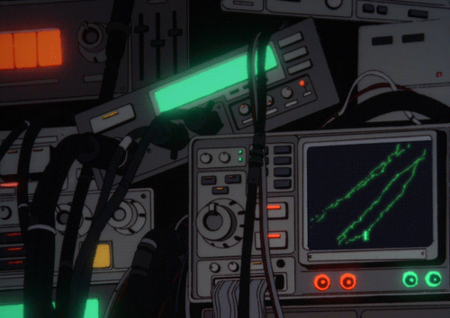
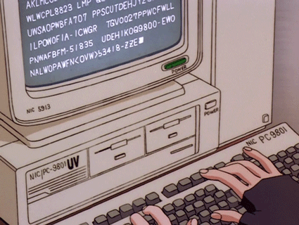

⬇️ 𝙒𝙚𝙡𝙘𝙤𝙢𝙚 𝙩𝙤 𝙢𝙮 𝙥𝙧𝙤𝙛𝙞𝙡𝙚 ⬇️
 ✨ Hi there, I'm Khanathippakorn 👋

### 🌸 Computer Engineering Student | Developer | IoT & AI Enthusiast 🌸

  

---

<h2 align="left"> 💬About Me🗨️</h2>

<table>
  <tr>
    <td width="34%" align="center" valign="top">
      
    </td>
    <td width="66%" valign="top" align="left">
      <b>bfirstkok@github</b> 
      ------------------------- 
       Computer Engineering Student 
       Rajamangala University of Technology Isan, Khon Kaen 
       Web Development | IoT | AI | System Design 
       Building projects that connect software + hardware 
       Learning Full Stack Development, Embedded Systems, and ML 
       Goal: Build useful technology for real-world problems 
       Love combining logic, creativity, and aesthetic design 
       Check my musical taste below ♡
    </td>
  </tr>
</table>

---

##  Featured Projects

###  Patient Monitoring & Queue Management System
A smart healthcare-related project for patient tracking, triage support, and queue management.  
Built with a focus on improving patient flow, monitoring, and decision support.

###  Smart Medicine Storage Room
An IoT + Digital Twin project using sensors, ESP32, and dashboard systems for monitoring medicine storage conditions.

###  Dino Forum
A web forum project with a modern dark theme, community features, and interactive user experience.

---

<h2 align="left">🎀 Tech Stack</h2>

<table>
  <tr>
    <td width="68%" valign="top">

<b>💻 Programming Languages</b>

  

<b>🚀 Frameworks & Libraries</b>

  

<b>🗄️ Databases & Tools</b>

  

<b>🔌 Hardware,Embedded/Network</b>

  
  
  
  
  
  
  
  
  

  </td>
    <td width="32%" align="center" valign="top">
        
      
    </td>
  </tr>
</table>

<h2 align="left">💼 <i>Work Experience</i></h2>

  

<table width="100%">
  <tr>
    <td valign="top" width="80%">
      <b>Pcampus Studio</b> 
      <i>Data Dictionary</i> 
      Designed database structures and prepared Data Dictionary documentation for a pharmacy platform project.  
      Worked on field definitions, variable mapping, and data planning for the web-based pharmacy management system.
    </td>
    <td valign="top" align="right" width="20%">
      <b>Feb. 2022</b>
    </td>
  </tr>
</table>

 

<table width="100%">
  <tr>
    <td valign="top" width="80%">
      <b>Bonlabofficial</b> 
      Collaborated on a project involving a critical-patient monitoring and queue management system.  
      Focused on production support and system-related implementation.
    </td>
    <td valign="top" align="right" width="20%">
      <b>Aug. 2026</b>
    </td>
  </tr>
</table>

---

##  GitHub Stats

  
  

---

## 🌸 Currently Working On

- Smart healthcare / hospital-related systems
- IoT monitoring dashboards
- AI-assisted decision support systems
- Personal portfolio and creative developer branding

---

<h2 align="center"> Contact</h2>

  

  Feel free to reach out ♡ 
  Just poke me again if I forget to reply (´ ▽ `;)

  ❀° ┄──━❀━──┄ °❀

  
  
  
  

  

  

---

###  “Code, Build, Improve, Repeat.”
### ૮ ˶ᵔ ᵕ ᵔ˶ ა

